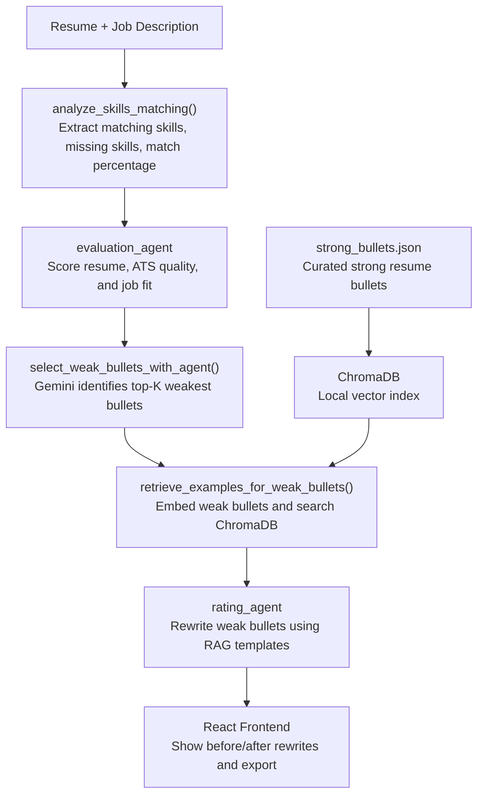

# Resume Optimizer

An AI-powered resume optimization platform that analyzes resumes against job descriptions, identifies gaps, and rewrites weak bullet points using a multi-agent pipeline and RAG.

Built with **Google ADK**, **Gemini**, **FastAPI**, **ChromaDB**, and **React**.

---

## What it does

1. **Upload** a resume (PDF, DOCX, or TXT)
2. **Paste** a target job description
3. The system runs a 3-stage AI pipeline:
   - **Evaluation agent** — scores your resume, identifies missing skills, analyzes ATS compatibility
   - **RAG selection** — identifies your weakest bullets relative to the JD and retrieves strong example rewrites from a curated knowledge base
   - **Rating agent** — rewrites your weak bullets using the retrieved examples as style guides, following STAR format and integrating missing JD skills
4. **Review** recommendations with before/after bullet comparisons
5. **Apply** rewrites with one click, export to PDF

Optionally: provide a **pool of additional experiences** and the system recommends which to swap in for better JD alignment.

---

## Architecture



---

## Tech stack

| Layer | Technology |
|---|---|
| Frontend | React 19, TypeScript, Vite, Tailwind CSS, Radix UI |
| Backend | Python, FastAPI, Uvicorn |
| AI agents | Google ADK, Gemini (`gemini-2.0-flash`) |
| RAG | ChromaDB (local vector DB), Google `text-embedding-004` |
| Resume parsing | PyPDF2, python-docx |
| Package manager | uv (Python), npm (Node) |
| Deployment | Render |

---

## Getting started

### Prerequisites

- Python 3.11+
- Node.js 20+
- [uv](https://docs.astral.sh/uv/getting-started/installation/) — Python package manager
- A [Gemini API key](https://aistudio.google.com/apikey)

### 1. Clone the repo

```bash
git clone https://github.com/your-username/resume-parser.git
cd resume-parser
```

### 2. Set up the backend

```bash
cd backend
uv venv
.venv\Scripts\activate        # Windows
# source .venv/bin/activate   # macOS/Linux
uv pip install -r pyproject.toml
```

Create `backend/.env`:

```
GEMINI_API_KEY="your-api-key-here"
REASONING_MODEL=gemini-2.0-flash
```

Start the backend:

```bash
cd src
uvicorn agent.app:app --host 127.0.0.1 --port 8000 --reload
```

### 3. Set up the frontend

```bash
cd frontend
npm install
npm run dev
```

Open [http://localhost:5173](http://localhost:5173).

> The Vite dev server proxies `/upload-resume`, `/evaluate-resume`, and `/analyze-experience-swaps` to the backend at `127.0.0.1:8000` automatically.

---

## RAG knowledge base

The system uses a curated set of **75 strong resume bullets** across 5 tech roles (Software Engineer, Data Scientist, ML Engineer, Product Manager, Data Engineer) stored in `backend/data/strong_bullets.json`.

On first run, the bullets are embedded using `text-embedding-004` and indexed into a local ChromaDB collection at `backend/.chroma`. Subsequent runs load the index from disk — no re-embedding needed.

---

## API endpoints

| Method | Endpoint | Description |
|---|---|---|
| `POST` | `/upload-resume` | Upload and parse a resume file |
| `POST` | `/evaluate-resume` | Run full evaluation + RAG rewrite pipeline |
| `POST` | `/analyze-experience-swaps` | Recommend experience swaps from a pool |

---

## Project structure

```
resume-parser/
├── backend/
│   ├── data/
│   │   └── strong_bullets.json     # RAG knowledge base
│   ├── src/agent/
│   │   ├── app.py                  # FastAPI routes
│   │   ├── agent.py                # ADK agent definitions
│   │   ├── rag.py                  # RAG pipeline
│   │   └── tools.py                # Skills analysis utilities
│   ├── pyproject.toml
│   └── .env                        # your API key (not committed)
└── frontend/
    ├── src/
    │   ├── App.tsx
    │   ├── components/
    │   └── types/
    ├── vite.config.ts
    └── package.json
```

---

## Notes

- The free tier of Gemini API supports ~1500 requests/day with `gemini-2.0-flash`
- The RAG index (`backend/.chroma`) is gitignored and built locally on first run
- Anti-hallucination rules are enforced in agent prompts — rewrites are grounded in the user's actual experience, not invented metrics
