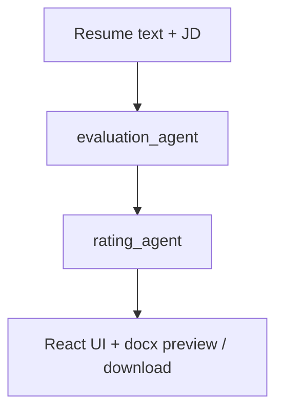
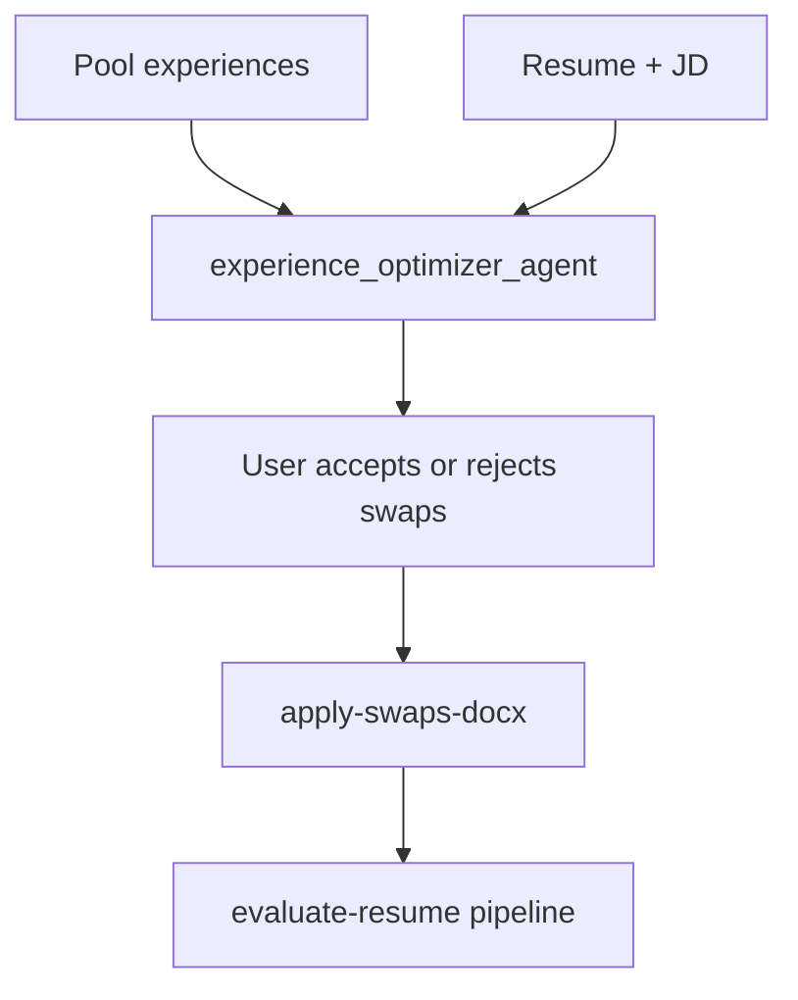

# BetterCV

An AI-powered resume optimization app that compares your resume to a job description, finds gaps, and suggests bullet rewrites using a multi-agent pipeline (Google ADK + OpenAI via LiteLLM).

Built with **FastAPI**, **React**, and **python-docx** for Word uploads and downloads.

---

## What it does

1. **Upload** a resume as a Word document (`.docx`)
2. **Paste** a target job description
3. The system runs a sequential AI pipeline:
   - **Evaluation agent** — summarizes fit, scores the resume, lists missing/matching skills, and flags weak bullets for rewrite
   - **Rating agent** — scores content/skills/relevance and produces 5–8 paraphrasing suggestions (exact `current_text` from your resume + suggested rewrites)
4. **Review** suggestions in the dashboard and preview, approve changes, and **download** an updated `.docx`

**Optional:** add a **pool of additional experiences**; the **experience optimizer** agent may recommend swapping a resume role for a stronger pool entry; accepting applies the swap in the document before evaluation.

---

## Architecture



With experience pool:



---

## Tech stack

| Layer | Technology |
|-------|------------|
| Frontend | React, TypeScript, Vite, Tailwind CSS |
| Backend | Python, FastAPI, Uvicorn |
| AI | Google ADK agents, LiteLLM → OpenAI (`REASONING_MODEL`) |
| Resume | PyPDF2, python-docx, PyMuPDF (legacy PDF paths if used) |
| Package manager | uv (Python), npm (Node) |

---

## Getting started

### Prerequisites

- Python 3.11+
- Node.js 20+
- [uv](https://docs.astral.sh/uv/getting-started/installation/)
- An **OpenAI API key** (or compatible endpoint configured for LiteLLM)

### 1. Clone the repo

```bash
git clone https://github.com/your-username/resume-parser.git
cd resume-parser
```

### 2. Backend

```bash
cd backend
uv venv
.venv\Scripts\activate        # Windows
# source .venv/bin/activate   # macOS/Linux
uv pip install -r pyproject.toml
```

Create `backend/.env`:

```
OPENAI_API_KEY=sk-...
REASONING_MODEL=gpt-4o-mini
```

Start the API:

```bash
cd src
uvicorn agent.app:app --host 127.0.0.1 --port 8000 --reload
```

### 3. Frontend

```bash
cd frontend
npm install
npm run dev
```

Open [http://localhost:5173](http://localhost:5173). Vite proxies API routes to `127.0.0.1:8000` (see `vite.config.ts`).

---

## API endpoints (selected)

| Method | Endpoint | Description |
|--------|----------|-------------|
| `POST` | `/upload-resume` | Upload `.docx`, returns extracted text and `doc_id` |
| `POST` | `/evaluate-resume` | Evaluation + rating agents |
| `POST` | `/analyze-experience-swaps` | Optimizer recommendations |
| `POST` | `/apply-swaps-docx` | Apply accepted swaps to stored doc |
| `GET` | `/resume-doc/{doc_id}` | Serve original or swapped doc for preview |
| `POST` | `/download-modified-docx` | Apply approved rewrites, return `.docx` |

---

## Project structure

```
resume-parser/
├── backend/
│   ├── src/agent/
│   │   ├── app.py           # FastAPI routes
│   │   ├── agent.py         # ADK agent definitions
│   │   ├── tools.py         # Resume/job helpers
│   │   └── guidelines.md    # Bullet-writing hints for agents
│   ├── pyproject.toml
│   └── .env
└── frontend/
    ├── src/
    └── vite.config.ts
```

---

## Notes

- Agent prompts stress honest rewrites: do not invent experience or metrics.
- The UI brand name in the app is **BetterCV**.
