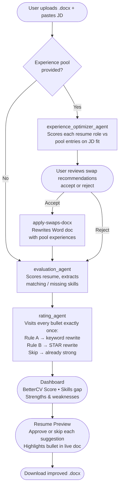

# BetterCV

An AI-powered resume optimization platform. Upload your `.docx` resume and paste a job description — a multi-agent pipeline evaluates your fit, rewrites weak bullets with missing JD keywords, and optionally swaps in stronger experiences from a pool.

---

## Features

- **Keyword gap analysis** — exhaustive extraction of every JD skill missing from your resume
- **Per-bullet rewrites** in two categories:
  - *Missing Skills*: bullets rewritten in STAR format with exact JD keywords inserted for ATS matching
  - *STAR Improvements*: bullets strengthened for clarity and impact without forcing keywords
- **BetterCV Score** — composite 0–100 score (40% keyword match · 35% overall quality · 25% experience relevance)
- **Experience pool swaps** — add extra experiences; AI recommends 1-for-1 swaps when a pool entry scores 20+ points higher than what's on your resume
- **In-browser review** — approve or skip each suggestion with a live document preview; download the modified `.docx` instantly

---

## How it works



---

## Tech stack

| Layer | Technology |
|-------|------------|
| Frontend | React 19, TypeScript, Vite, Tailwind CSS, Radix UI |
| Backend | Python 3.11, FastAPI, Uvicorn |
| AI | Google ADK agents, LiteLLM → OpenAI (`REASONING_MODEL`) |
| Documents | python-docx (Word), PyMuPDF (PDF) |
| Package managers | uv (Python), npm (Node) |

---

## Running locally

### Prerequisites

| Tool | Version | Install |
|------|---------|---------|
| Python | 3.11+ | [python.org](https://www.python.org/downloads/) |
| Node.js | 20+ | [nodejs.org](https://nodejs.org/) |
| uv | latest | `curl -LsSf https://astral.sh/uv/install.sh \| sh` |
| OpenAI API key | — | [platform.openai.com](https://platform.openai.com/api-keys) |

### 1. Clone the repo

```bash
git clone https://github.com/zxu73/resume-parser.git
cd resume-parser
```

### 2. Set up the backend

```bash
cd backend

# Create and activate a virtual environment
uv venv
.venv\Scripts\activate        # Windows
# source .venv/bin/activate   # macOS / Linux

# Install dependencies
uv pip install -r pyproject.toml
```

Create a `backend/.env` file:

```bash
OPENAI_API_KEY=sk-...          # required
REASONING_MODEL=gpt-4o-mini    # optional — any LiteLLM-compatible model
```

### 3. Set up the frontend

```bash
cd frontend
npm install
```

### 4. Start both servers

From the project root:

```bash
make dev
```

This starts:
- **Frontend** at [http://localhost:5173](http://localhost:5173) — Vite dev server, proxies `/api` calls to the backend
- **Backend** at [http://localhost:8000](http://localhost:8000) — Google ADK server

Or start them individually in separate terminals:

```bash
# Terminal 1 — backend
cd backend && adk web

# Terminal 2 — frontend
cd frontend && npm run dev
```

Then open [http://localhost:5173](http://localhost:5173) in your browser.

---

## API endpoints

| Method | Endpoint | Description |
|--------|----------|-------------|
| `POST` | `/upload-resume` | Upload `.docx`, returns extracted text and `doc_id` |
| `POST` | `/evaluate-resume` | Evaluation + rating agents |
| `POST` | `/analyze-experience-swaps` | Optimizer recommendations |
| `POST` | `/apply-swaps-docx` | Apply accepted swaps to stored doc |
| `GET`  | `/resume-doc/{doc_id}` | Serve original or swapped doc for preview |
| `POST` | `/download-modified-docx` | Apply approved rewrites, return `.docx` |

---

## Project structure

```
resume-parser/
├── backend/
│   └── src/agent/
│       ├── app.py          # FastAPI routes + post-processing
│       ├── agent.py        # ADK agent definitions + Pydantic schemas
│       ├── tools.py        # Resume extraction helpers
│       └── guidelines.md   # Bullet-rewriting rules loaded into Rating Agent
└── frontend/
    └── src/
        ├── App.tsx
        ├── components/
        │   ├── AnalysisDashboard.tsx
        │   ├── ResumePreview.tsx
        │   └── ExperienceManager.tsx
        └── types/analysis.ts
```

---

## Deployment

Deployed on [Render](https://render.com) via `render.yaml`. The backend serves the compiled React frontend as static files from `/frontend/dist`.
